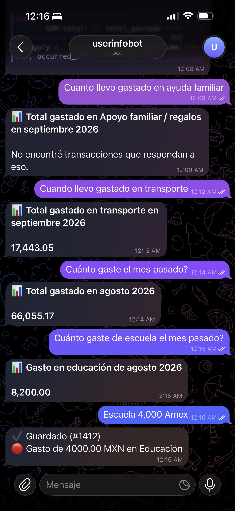
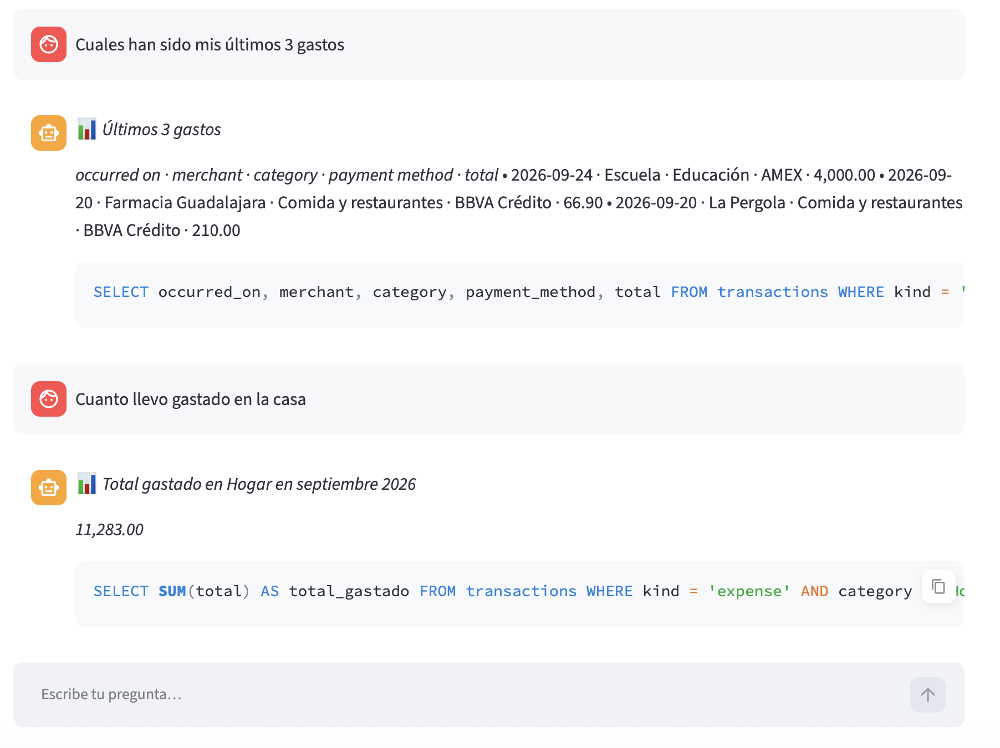

# expenses_agent — README con demo

> Documento local, **no se sube al repo** (excluido vía `.git/info/exclude` junto con
> `imagenes_pruebas/`). Contiene todo el `README.md` más capturas reales del bot de Telegram y
> del dashboard de Streamlit mostrando lo que puede hacer el agente.

# LINK DEL REPO: https://github.com/alcatere/expenses_agent.git

Bot de Telegram que clasifica automáticamente tus gastos e ingresos a partir de fotos de
recibos o descripciones en texto. Corre **100% en tu computadora**: el modelo que lee los
recibos es local (vía [Ollama](https://ollama.com)) y los datos se guardan en un archivo
SQLite en tu disco. Nada sale de tu máquina salvo la conexión normal con los servidores de
Telegram para recibir/enviar mensajes.

## Cómo funciona

1. Le mandas al bot la foto de un ticket, o le escribes algo como "gasté 250 en uber con nu".
2. Un modelo de visión local (`qwen3.5:9b` vía Ollama) extrae: tipo (gasto/ingreso), comercio,
   fecha, monto, moneda, categoría y medio de pago.
3. El bot te muestra lo que detectó con botones para corregir categoría, medio de pago o el
   tipo, antes de guardar nada.
4. Al confirmar, se guarda en SQLite. Puedes pedir resúmenes mensuales o exportar a CSV.

## Requisitos

- macOS/Linux con Python 3.12+.
- [`uv`](https://docs.astral.sh/uv/) para manejar el entorno y las dependencias.
- [Ollama](https://ollama.com) corriendo localmente, con un modelo de visión descargado
  (por defecto `qwen3.5:9b`: `ollama pull qwen3.5:9b`).
- Un bot de Telegram (gratis, se crea en 1 minuto).

## Setup

### 1. Instala dependencias

```bash
brew install uv          # si no lo tienes
make install             # uv sync
```

### 2. Crea tu bot de Telegram

1. Abre Telegram y busca **@BotFather**.
2. Envía `/newbot`, sigue las instrucciones y copia el **token** que te da.
3. Busca **@userinfobot**, mándale un mensaje y copia tu **user ID** (un número).

### 3. Configura tus variables de entorno

```bash
cp .env.example .env
```

Edita `.env`:

```dotenv
TELEGRAM_BOT_TOKEN=el_token_de_botfather
ALLOWED_USER_IDS=tu_user_id          # separa con comas si son varios
OLLAMA_MODEL=qwen3.5:9b
CARDS=BBVA Azul:1234,Nu:5678,Efectivo,Transferencia
DEFAULT_CURRENCY=MXN
```

Las categorías (`src/expenses_agent/domain/taxonomy.py`) y los medios de pago (`CARDS`)
de este repo ya vienen ajustados a un historial real de gastos/ingresos (ver
[Importar tu historial existente](#importar-tu-historial-existente-csv) abajo) — edítalos
libremente si tu caso es distinto.

`ALLOWED_USER_IDS` es importante: sin ella, cualquiera que encuentre tu bot podría usarlo.

### 4. Asegúrate de que Ollama esté corriendo

```bash
ollama serve &            # o abre la app de Ollama desde el menú
ollama pull qwen3.5:9b    # si aún no lo tienes descargado
```

### 5. Corre el bot

```bash
make run
```

Deberías ver en los logs `Bot listo (modelo qwen3.5:9b OK)`. Ahora mándale un mensaje a tu
bot en Telegram (`/start`).

## Comandos del bot

| Comando | Qué hace |
|---|---|
| `/start`, `/help` | Explica cómo usar el bot |
| `/resumen [YYYY-MM]` | Resumen del mes: totales, por categoría, por medio de pago |
| `/ultimos [n]` | Últimas `n` transacciones guardadas (default 10) |
| `/export [YYYY-MM]` | Descarga un CSV del mes |
| `/cancel` | Cancela una confirmación pendiente |

Enviar una **foto** (o un documento de imagen) o un **texto libre** dispara la clasificación.

## Preguntas en lenguaje natural

Además de registrar transacciones, puedes preguntarle al bot cualquier cosa sobre tus
datos ya guardados, por ejemplo:

- "¿cuál fue mi último gasto en Nu?"
- "¿cuánto llevo en súper este mes?"
- "¿cuál ha sido mi gasto más grande del mes?"
- "¿qué gastos hice el 15 de septiembre?"
- "¿cuánto gasté en promedio por día en agosto?"
- "¿en qué categoría gasto más?"

Cada mensaje de texto pasa primero por un clasificador local que decide si es una
**pregunta** o una **transacción nueva**. Si es pregunta, el modelo traduce el lenguaje
natural a una consulta SQL, que se ejecuta sobre la base en **modo estricto de solo
lectura**: SQLite rechaza cualquier cosa que no sea un `SELECT` sobre la tabla de
transacciones (nada de `INSERT`/`UPDATE`/`DELETE`/`DROP`/`PRAGMA`), con tope de filas y
de tiempo. La respuesta se arma con las filas reales que devuelve la base — el modelo
nunca inventa montos ni cifras. En Telegram se muestra solo el resultado; en el dashboard
también se incluye el SQL usado para que puedas verificar qué se consultó.

### Demo: el agente en Telegram



**Preguntas sobre los gastos:**

| Pregunta | Respuesta del agente |
|---|---|
| *Cuánto llevo gastado en transporte* | **Total gastado en transporte en septiembre 2026** — 17,443.05 |
| *Cuánto gasté el mes pasado?* | **Total gastado en agosto 2026** — 66,055.17 |
| *Cuánto gasté de escuela el mes pasado?* | **Gasto en educación de agosto 2026** — 8,200.00 |
| *Cuánto llevo gastado en ayuda familiar* | **Total gastado en Apoyo familiar / regalos en septiembre 2026** — No encontré transacciones que respondan a eso. |

Detalles que se ven en la captura:

- **Mapeo a la taxonomía**: "escuela" → *Educación*, "ayuda familiar" → *Apoyo familiar / regalos*.
- **Fechas relativas**: "el mes pasado" se resuelve a agosto 2026; sin periodo explícito, se
  asume el mes en curso.
- **Sin resultados**: si la consulta no devuelve filas, lo dice en lugar de inventar un 0.

**Registrar un gasto con texto libre:**

| Mensaje | Respuesta del agente |
|---|---|
| *Escuela 4,000 Amex* | ✅ Guardado (#1412) — 🔴 Gasto de 4000.00 MXN en Educación |

Con un mensaje corto el agente extrae comercio, monto, categoría y medio de pago (la tarjeta
AMEX de `CARDS`) y lo guarda.

## Dashboard local (ver y editar)

Para ver todas tus transacciones en una tabla, filtrarlas, editarlas o borrarlas, corre:

```bash
uv run streamlit run scripts/dashboard.py
```

Se abre en tu navegador (`http://localhost:8501`), lee y escribe sobre el mismo
`data/expenses.db` que usa el bot. Puedes:

- Filtrar por tipo, categoría, medio de pago o buscar texto en comercio/notas.
- Editar cualquier celda directamente en la tabla (fecha, monto, categoría, etc.).
- Borrar una fila con el ícono de la izquierda, o agregar una nueva con el botón `+`.
- Ver totales de gastos/ingresos/balance del filtro actual en tiempo real.

Los cambios no se guardan hasta que presionas **"💾 Guardar cambios"**. El bot y el
dashboard pueden correr al mismo tiempo sin problema.

### Demo: el agente en el dashboard



La misma lógica de preguntas que en Telegram, pero aquí **se muestra el SQL generado** debajo
de cada respuesta.

| Pregunta | Respuesta del agente |
|---|---|
| *Cuáles han sido mis últimos 3 gastos* | **Últimos 3 gastos** — fecha, comercio, categoría, medio de pago y total (Escuela 4,000.00 AMEX; Farmacia Guadalajara 66.90; La Pergola 210.00) |
| *Cuánto llevo gastado en la casa* | **Total gastado en Hogar en septiembre 2026** — 11,283.00 |

Ejemplos del SQL mostrado:

```sql
SELECT occurred_on, merchant, category, payment_method, total
FROM transactions WHERE kind = 'expense' ...

SELECT SUM(total) AS total_gastado
FROM transactions WHERE kind = 'expense' AND category = ...
```

El gasto *Escuela 4,000 AMEX* registrado desde Telegram aparece de inmediato en el dashboard:
ambas superficies comparten base de datos y `TransactionService`.

## Desarrollo

```bash
make lint        # ruff check
make format      # ruff format
make typecheck   # mypy --strict
make test        # pytest
make check       # lint + typecheck + test
```

### Importar tu historial existente (CSV)

Si ya llevas tus gastos e ingresos en una hoja de cálculo, `scripts/import_csv.py` los
carga de una sola vez a la base de datos del bot, sin pasar por el LLM (los datos ya
están estructurados).

Formato esperado (columnas mínimas; `Mes`/`Dia`/`Anio`/`Numero Semana` se ignoran si
existen, se recalculan de `Fecha`):

```csv
Fecha,Producto o servicio,IE,Tipo,Tarjeta banco,Monto
26/04/2025,Cafeteria Juan Valdez,EGRESO,Comida,AMEX,$79.00
30/04/2025,Pago Claryen,INGRESO,na,BBVA,"$42,500.00"
```

- `IE`: `INGRESO` o `EGRESO`.
- `Tipo`: tu categoría libre; se traduce a la taxonomía del bot con `EXPENSE_TIPO_MAP`
  (gastos) o unas reglas por palabra clave (ingresos, porque en la práctica esa columna
  suele ser muy inconsistente — "na" para casi todo). Ajusta esas tablas en el script si
  tus categorías son distintas.
- `Tarjeta banco`: se normaliza con `CARD_MAP` (ej. "Transferencia NU" y "Nu Transferencia"
  se unifican en un solo medio de pago).

```bash
# Primero en modo simulación, para ver el resumen sin escribir nada:
uv run python scripts/import_csv.py --csv data/import/tu_archivo.csv \
    --telegram-user-id TU_USER_ID --dry-run

# Si se ve bien, corre sin --dry-run:
uv run python scripts/import_csv.py --csv data/import/tu_archivo.csv \
    --telegram-user-id TU_USER_ID
```

Es idempotente (dedup por fecha+comercio+monto+tipo): puedes volver a correrlo después
de agregar filas nuevas al CSV sin duplicar lo que ya se importó. Al final imprime
cualquier `Tipo` o `Tarjeta banco` que no haya podido mapear, para que ajustes las tablas.

### Migraciones de base de datos

El esquema se crea automáticamente al arrancar el bot (`Base.metadata.create_all`). Para
cambios de esquema futuros, usa Alembic:

```bash
uv run alembic revision --autogenerate -m "descripción del cambio"
make migrate
```

### Mejorando la precisión del modelo (evals)

1. Copia 10-20 fotos de recibos reales a `evals/receipts/`.
2. Por cada una, agrega una línea a `evals/expected.jsonl`:
   ```json
   {"file": "ticket1.jpg", "kind": "expense", "merchant": "Oxxo", "total": 125.50, "category": "Supermercado"}
   ```
3. Corre:
   ```bash
   uv run python evals/run_eval.py
   ```
   Te da el % de aciertos por campo. Útil para ajustar el prompt en
   `src/expenses_agent/extraction/prompts.py` o probar otro modelo de Ollama.

## Estructura del proyecto

```
src/expenses_agent/
├── config.py              # Settings desde .env
├── domain/                 # Modelos Pydantic y categorías
├── extraction/              # Extractor con Ollama + prompts + normalización de imagen
├── storage/                 # SQLAlchemy: tablas, engine, repositorio
├── services/                 # Orquestación: extraer -> confirmar -> guardar
└── bot/                       # python-telegram-bot: handlers, teclados, formato

scripts/import_csv.py     # Importa un historial existente desde CSV (ver arriba)
```

## Privacidad

- Las fotos de recibos se guardan en `data/receipts/` (no se sube a ningún lado).
- La base de datos vive en `data/expenses.db`.
- El único tráfico de red es hacia la API de Telegram (para el bot) y hacia tu propio
  Ollama local (`localhost:11434`). No se usa ninguna API de IA en la nube en esta fase.

## Roadmap (fase 2)

- Detección de duplicados.
- Dashboard local para explorar tus gastos.
- Presupuestos por categoría con alertas.
- Extractor alternativo con Claude (mayor precisión, requiere API key) detrás del mismo
  `ReceiptExtractor` protocol, para comparar con `evals/run_eval.py`.
- Notas de voz transcritas localmente con Whisper.
