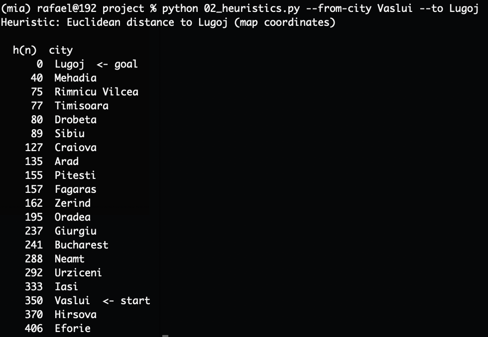
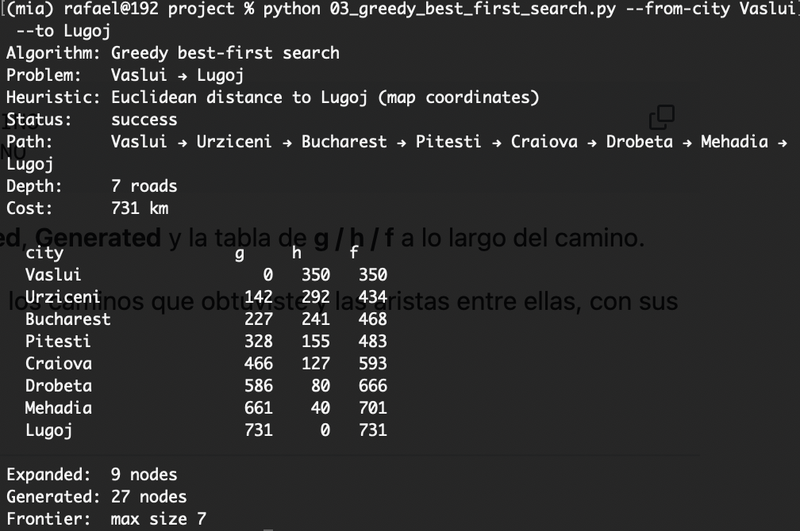
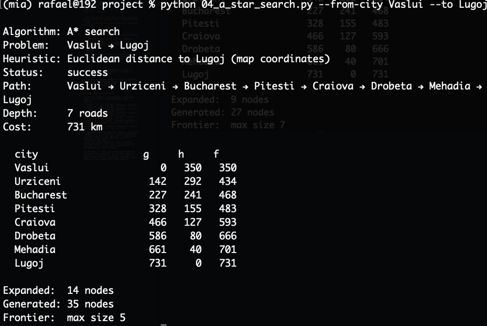

## Las ciudades que elegire son:
-- from-city Vaslui
-- to Lugoj

Se tiene la siguiente Heuristica para el par elegido:

Los resultados de las diferentes búsquedas son los siguientes:

- Greedy Best First Search (GBFS):

- A* Search:

En mi caso podemos notar que tanto GBFS como A* encontraron el mismo camino óptimo en términos de costo (km), pero A* expandió mas nodos que GBFS, lo que indica que A* es más eficiente en este caso.

En mi caso f si tiende a disminuir a medida que se acerca a la meta, lo que indica que la heuristica es admisible y consistente.
