Las ciudades que elegire son:
-- from-city Giurgiu
-- to Neamt

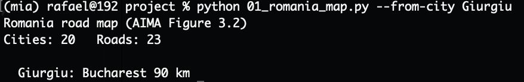

Salida de BFS:
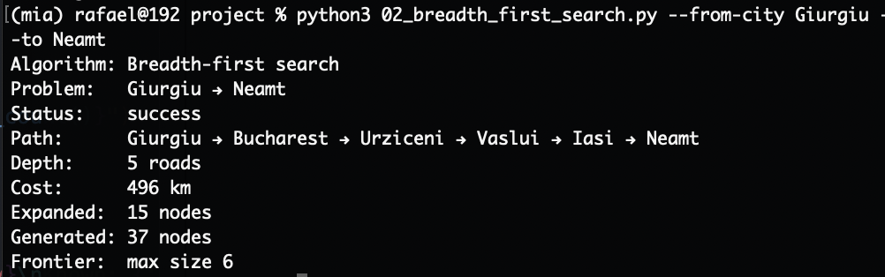

#### Subgrafo Relevante — BFS
- **Camino:** Giurgiu → Bucharest → Urziceni → Vaslui → Iasi → Neamt
- **Profundidad (Depth):** 5 carreteras | **Costo (Cost):** 496 km

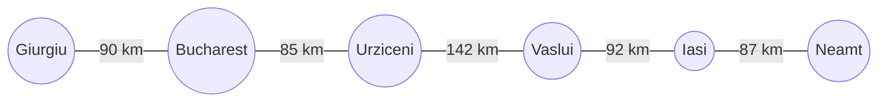

```text
[Giurgiu] --- 90 km ---> [Bucharest] --- 85 km ---> [Urziceni] --- 142 km ---> [Vaslui] --- 92 km ---> [Iasi] --- 87 km ---> [Neamt]
```

- **Aristas:** (Giurgiu, Bucharest: 90 km), (Bucharest, Urziceni: 85 km), (Urziceni, Vaslui: 142 km), (Vaslui, Iasi: 92 km), (Iasi, Neamt: 87 km)

---

Salida de UCS:
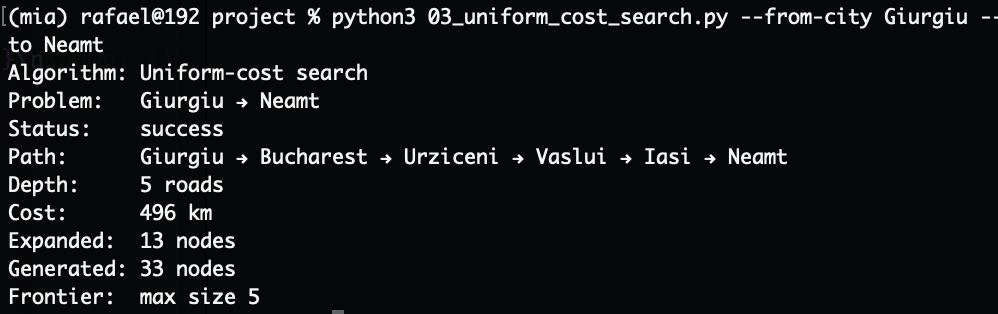

#### Subgrafo Relevante — UCS
- **Camino:** Giurgiu → Bucharest → Urziceni → Vaslui → Iasi → Neamt
- **Profundidad (Depth):** 5 carreteras | **Costo (Cost):** 496 km (óptimo en km)


```text
[Giurgiu] --- 90 km ---> [Bucharest] --- 85 km ---> [Urziceni] --- 142 km ---> [Vaslui] --- 92 km ---> [Iasi] --- 87 km ---> [Neamt]
```

- **Aristas:** (Giurgiu, Bucharest: 90 km), (Bucharest, Urziceni: 85 km), (Urziceni, Vaslui: 142 km), (Vaslui, Iasi: 92 km), (Iasi, Neamt: 87 km)

---

Salida de DFS:
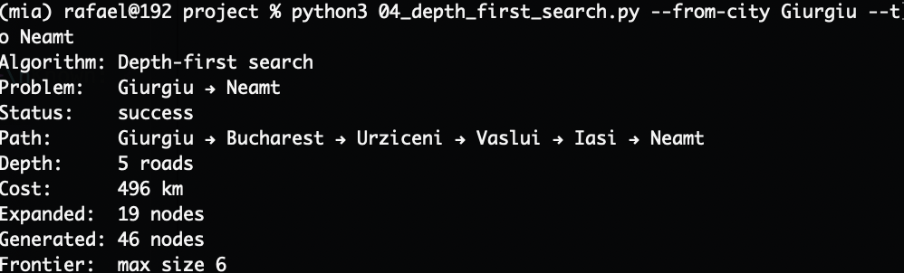

#### Subgrafo Relevante — DFS
- **Camino:** Giurgiu → Bucharest → Urziceni → Vaslui → Iasi → Neamt
- **Profundidad (Depth):** 5 carreteras | **Costo (Cost):** 496 km


```text
[Giurgiu] --- 90 km ---> [Bucharest] --- 85 km ---> [Urziceni] --- 142 km ---> [Vaslui] --- 92 km ---> [Iasi] --- 87 km ---> [Neamt]
```

- **Aristas:** (Giurgiu, Bucharest: 90 km), (Bucharest, Urziceni: 85 km), (Urziceni, Vaslui: 142 km), (Vaslui, Iasi: 92 km), (Iasi, Neamt: 87 km)

---

Salida de DLS con limit 2:
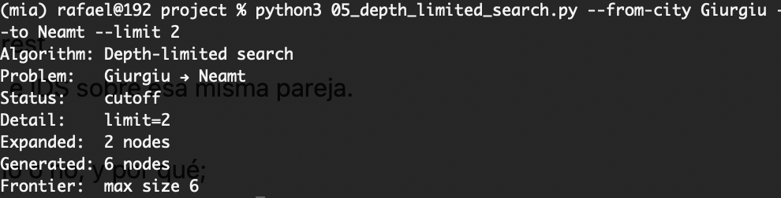

#### Subgrafo Relevante — DLS (limit=2)
- **Estado:** `cutoff` (No alcanza **Neamt** porque la meta está a profundidad 5 y el límite fijado es 2).
- **Ramas alcanzadas hasta profundidad 2:**
  - `Giurgiu` (Prof. 0)
  - `Bucharest` (Prof. 1) a 90 km
  - Frontera en Prof. 2: `Urziceni` (85 km, en dirección a la meta), `Fagaras` (211 km), `Pitesti` (101 km).

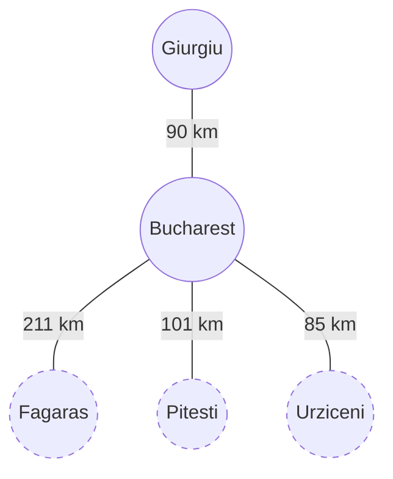

```text
[Giurgiu] (Prof. 0)
    │
    └── 90 km ──> [Bucharest] (Prof. 1)
                      ├── 211 km ──> [Fagaras]  (Prof. 2 - Corte)
                      ├── 101 km ──> [Pitesti]  (Prof. 2 - Corte)
                      └──  85 km ──> [Urziceni] (Prof. 2 - Corte hacia meta)
```

- **Camino parcial hacia la meta:** `Giurgiu → Bucharest → Urziceni` (175 km acumulados, cortado a 3 saltos del objetivo).

---

Salida de DLS con limit 4:
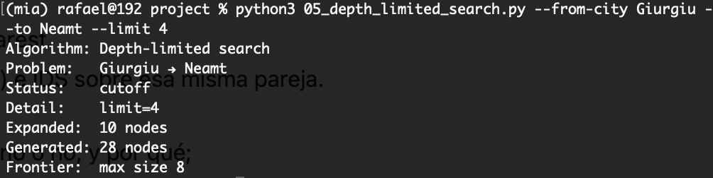

#### Subgrafo Relevante — DLS (limit=4)
- **Estado:** `cutoff` (Límite 4 insuficiente para alcanzar **Neamt** a profundidad 5).
- **Camino avanzado hacia la meta hasta el corte:** `Giurgiu → Bucharest → Urziceni → Vaslui → Iasi`

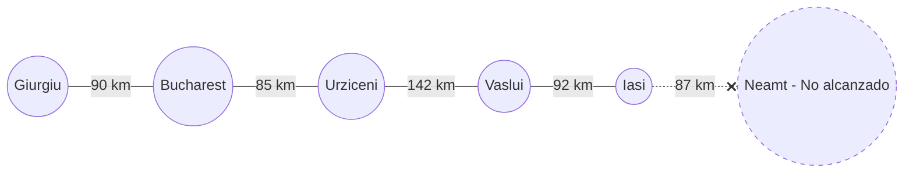

```text
[Giurgiu] --- 90 km ---> [Bucharest] --- 85 km ---> [Urziceni] --- 142 km ---> [Vaslui] --- 92 km ---> [Iasi] - - (87 km) - -X [Neamt]
(Prof. 0)                (Prof. 1)                  (Prof. 2)                 (Prof. 3)               (Prof. 4)                (Prof. 5)
```

- **Aristas del camino recorrido:** (Giurgiu, Bucharest: 90 km), (Bucharest, Urziceni: 85 km), (Urziceni, Vaslui: 142 km), (Vaslui, Iasi: 92 km).
- **Costo acumulado hasta corte:** 409 km (cortado a solo 1 carretera / 87 km de Neamt).

---

Salida de DLS Complete:
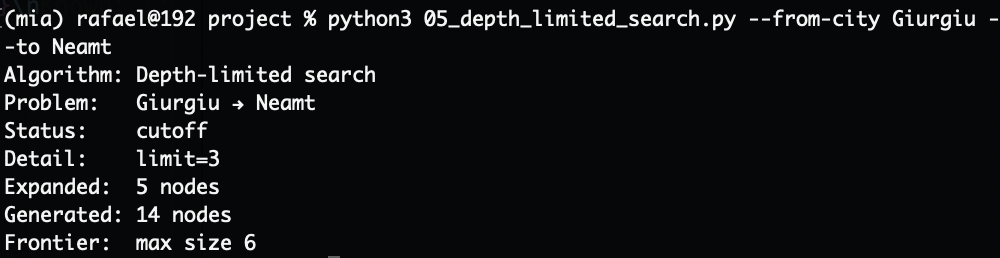

#### Subgrafo Relevante — DLS Complete (limit=3 por defecto)
- **Estado:** `cutoff` (Ejecutado sin argumento `--limit`, toma por defecto `limit=3`; no alcanza **Neamt** a profundidad 5).
- **Camino avanzado hacia la meta hasta el corte:** `Giurgiu → Bucharest → Urziceni → Vaslui`

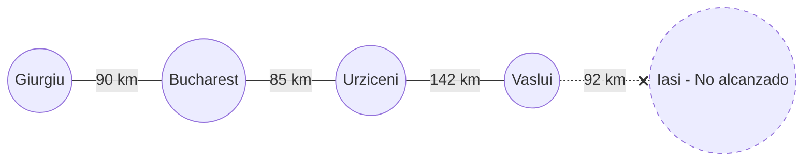

```text
[Giurgiu] --- 90 km ---> [Bucharest] --- 85 km ---> [Urziceni] --- 142 km ---> [Vaslui] - - (92 km) - -X [Iasi] ... [Neamt]
(Prof. 0)                (Prof. 1)                  (Prof. 2)                 (Prof. 3)                (Prof. 4)     (Prof. 5)
```

- **Aristas del camino recorrido:** (Giurgiu, Bucharest: 90 km), (Bucharest, Urziceni: 85 km), (Urziceni, Vaslui: 142 km).
- **Costo acumulado hasta corte:** 317 km (3 carreteras recorridas).

---

Salida de IDS:
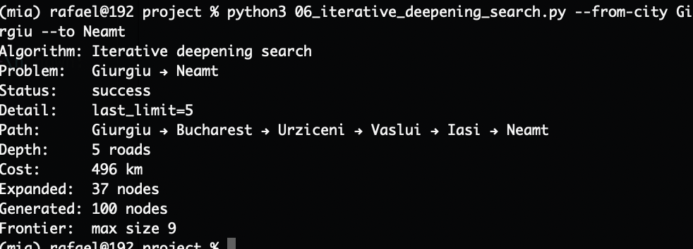

#### Subgrafo Relevante — IDS (Iterative Deepening Search)
- **Estado:** `success` (`last_limit=5`)
- **Profundidad (Depth):** 5 carreteras | **Costo (Cost):** 496 km


```text
[Giurgiu] --- 90 km ---> [Bucharest] --- 85 km ---> [Urziceni] --- 142 km ---> [Vaslui] --- 92 km ---> [Iasi] --- 87 km ---> [Neamt]
```

- **Aristas:** (Giurgiu, Bucharest: 90 km), (Bucharest, Urziceni: 85 km), (Urziceni, Vaslui: 142 km), (Vaslui, Iasi: 92 km), (Iasi, Neamt: 87 km)
- **Costo total:** 496 km

---

## Tabla Resumen de Comparación

| Algoritmo | Estado | Camino Obtenido | Profundidad (hops) | Costo (km) | Nodos Expandidos | Nodos Generados |
|---|---|---|:---:|:---:|:---:|:---:|
| **BFS** | `success` | Giurgiu → Bucharest → Urziceni → Vaslui → Iasi → Neamt | 5 | 496 | 15 | 37 |
| **UCS** | `success` | Giurgiu → Bucharest → Urziceni → Vaslui → Iasi → Neamt | 5 | 496 | 13 | 33 |
| **DFS** | `success` | Giurgiu → Bucharest → Urziceni → Vaslui → Iasi → Neamt | 5 | 496 | 19 | 46 |
| **DLS (limit=2)** | `cutoff` | Giurgiu → Bucharest → Urziceni *(cortado)* | 2 | 175 *(parcial)* | 2 | 6 |
| **DLS (limit=4)** | `cutoff` | Giurgiu → Bucharest → Urziceni → Vaslui → Iasi *(cortado)* | 4 | 409 *(parcial)* | 10 | 28 |
| **IDS** | `success` | Giurgiu → Bucharest → Urziceni → Vaslui → Iasi → Neamt | 5 | 496 | 37 | 100 |

Con base a la tabla de comparación, podemos concluir que:
- **BFS** y **UCS** encontraron el mismo camino óptimo en términos de costo (km), pero **UCS** expandió menos nodos que **BFS**, lo que indica que UCS es más eficiente en este caso.
- **DFS** e **IDS** tuvieron el mismo resultado en términos de camino y costo, pero **DFS** expandió más nodos que **IDS**, lo que sugiere que IDS es más eficiente en la búsqueda iterativa.

En este caso, el camino óptimo hacia Neamt tiene una profundidad de 5 carreteras. Por lo tanto, cuando se establece un límite de 2 o 4 en DLS, la búsqueda no puede alcanzar la meta y devuelve un estado de `cutoff` porque no llega a explorar el camino completo.